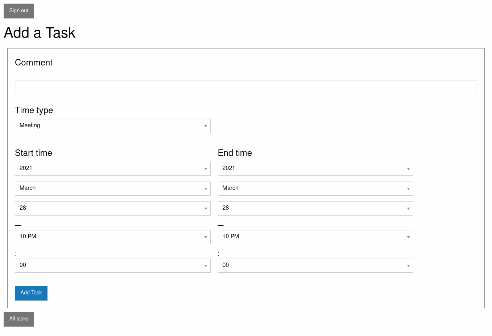

# Time Tracker 

> Time Tracker!

## Live demo

Please [check](https://time-track-hasan.herokuapp.com/).
## Description

In this project, a website similar to [toggl](https://toggl.com/) is built. This website is for companies tracking working time of their teams.

## Features

Tasks can be created by any user.
Tasks can be listed and filtered by admins

## Built with

- Ruby v2.7.2
- Ruby on Rails v6.1.3
- [Haml](https://haml.info/)
- [Foundation](https://get.foundation/) 
- Devise
- RSpec
- PostgreSQL

## Setup

- Clone this repository
- Open terminal
- Change directory by using `cd whistle/`
- Run `bundle install`
- Run `rails db:migrate`
- Open rails server by using `rails s`
- Open browser and go to http://localhost:3000

## Test app

- Follow steps given in Setup part
- Run `rails db:test:prepare` on your terminal
- Run `rspec`
- Or, run `bundle exec guard` to watch files for tests

## Author

Reach out to us at one of the following places!

👤 **Hasan Özovalı**

- Website: [ozovalihasan.com](https://www.ozovalihasan.com/)
- LinkedIn: [Hasan Özovalı](https://www.linkedin.com/in/hasan-ozovali/)
- Github: [@ozovalihasan](https://github.com/ozovalihasan)
- Twitter: [@ozovalihasan](https://twitter.com/ozovalihasan)
- Mail: [ozovalihasan@gmail.com](mailto:ozovalihasan@gmail.com)

## Contributing 🤝

Contributions, issues, and feature requests are welcome!

Feel free to check the [issues page](https://github.com/ozovalihasan/time-track/issues).

## Show your support

Give a ⭐️ if you like this project!

## License

- **[MIT license](http://opensource.org/licenses/mit-license.php)**
